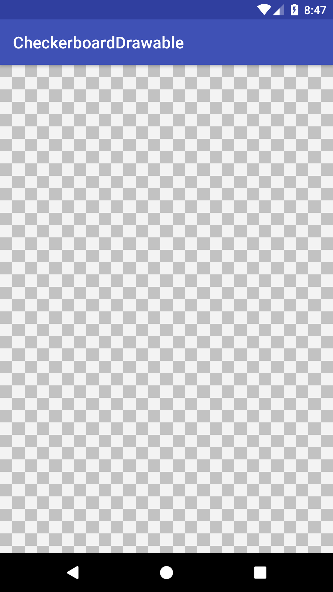

# CheckerboardDrawable [](https://github.com/duanhong169/CheckerboardDrawable/releases) [](https://developer.android.com/index.html) <a target="_blank" href="https://android-arsenal.com/api?level=14"></a> [](https://github.com/duanhong169/CheckerboardDrawable/blob/master/LICENSE)


A custom Drawable to use as background which embody "transparent", AKA checkerboard grid.



## Gradle

```
dependencies {
    implementation 'com.github.duanhong169:checkerboarddrawable:${latestVersion}'
    ...
}
```

> Replace `${latestVersion}` with the latest version code. See [releases](https://github.com/duanhong169/CheckerboardDrawable/releases).

## Usage

### Use `CheckerboardDrawable.create()` and set as background drawable

```java
    yourView.setBackgroundDrawable(CheckerboardDrawable.create());
```

### Custom

```java
    CheckerboardDrawable drawable = new CheckerboardDrawable.Builder()
            .colorOdd(Color.LTGRAY)
            .colorEven(Color.DKGRAY)
            .size(20)
            .build();
    yourView.setBackgroundDrawable(drawable);
```

## License

See the [LICENSE](./LICENSE) file.